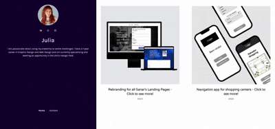

# Site de Portfólio UX/UI

Este projeto foi desenvolvido a pedido de uma amiga que está em transição de carreira para a área de UX/UI. O objetivo foi aprimorar o site que ela criou utilizando uma plataforma de criação sem código, a qual, embora útil, apresenta diversas limitações. Com isso, recriei o site, oferecendo mais flexibilidade e recursos. O resultado final pode ser acessado em: https://landing-page-julia-sigma.vercel.app/.

## Stack utilizada

**Front-end:**:
- **React + Vite**: Escolhido pela rapidez no desenvolvimento e na configuração do ambiente, além da facilidade de publicação e otimização de desempenho.
- **TypeScript**: Adotado para garantir maior segurança e produtividade, proporcionando tipagens específicas que alinham as necessidades do projeto.
- **Bootstrap**: Utilizado para aproveitar soluções prontas e otimizadas, acelerando o desenvolvimento de interfaces modernas e responsivas.
- **React Router DOM**: Usado para gerenciar a navegação entre diferentes rotas dentro de uma mesma SPA (Single Page Application), proporcionando uma navegação fluida.
- **React-Icons**: Ferramenta prática para integrar ícones como componentes React, facilitando a personalização e a adaptação visual.
- **Styled Components**: Utilizado pela sua flexibilidade na criação de componentes estilizados, permitindo a estilização de forma dinâmica e eficiente, mantendo o código modular e limpo.

**Back-end**
- **Express**: Utilizei o Express.js para criar um servidor simples e eficiente, responsável pelo envio de e-mails a partir do site do front-end. A comunicação é realizada através da biblioteca @sendgrid/mail, garantindo a integração com a plataforma SendGrid para o envio de mensagens.

## Demonstração


## Rodando localmente

Crie uma pasta onde o projeto irá ficar

Acesse a pasta em questão pelo terminal e clone o projeto com o seguinte comando:
```bash
  git clone https://github.com/luanpoppe/landing-page-julia.git .
```

Instale as dependências
```bash
  npm install
```

Inicialize o projeto

```bash
  npm run dev
```

Inicialize o servidor back-end:
```bash
  cd ./email-server
  node --watch app.js
```

## Funcionalidades
- Totalmente responsivo, adaptando-se a diferentes tamanhos de tela
- Navegação para diferentes áreas do site por rotas diferentes
- Animações utilizadas para aprimorar a experiência do usuário e torná-la mais fluida


## Melhorias
- Adicionar opção de tema dark e light
